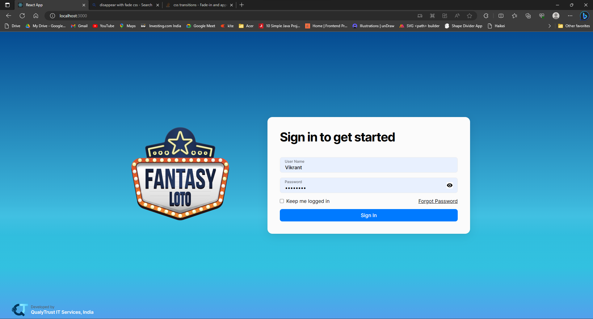
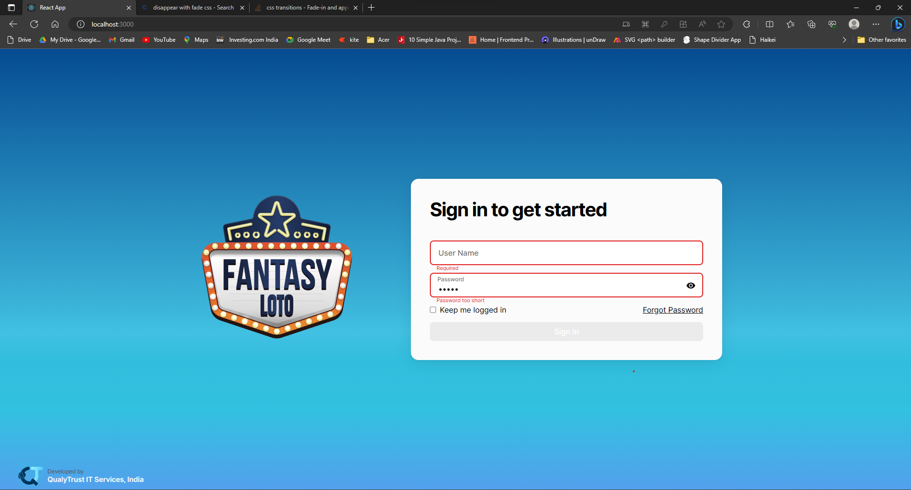
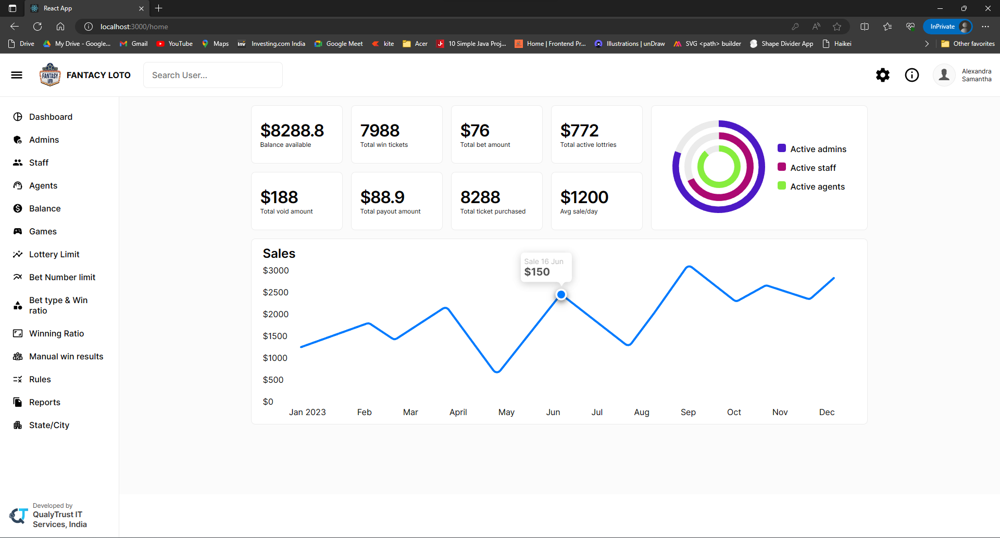

#   FANTACY LOTO

## project-documentation

<p align="center">
  <a href="" rel="noopener">
 </a>
</p>


<h3 align="center">FANCTACY LOTO</h3>

---
<div align="center">

  []()
  [](https://github.com/kylelobo/The-Documentation-Compendium/pulls)
  [](/LICENSE)

</div>


## 📝 Table of Contents
- [About](#about)
- [Getting Started](#getting_started)
- [Deployment](#deployment)
- [Project View](#projectView)
- [Features](features)
- [Authors](#authors)
- [Acknowledgments](#acknowledgement)

## 🧐 About <a name = "about"></a>
A website for a fictitious online gaming website, with additional perks of winning real money with your skills.

## 🏁 Getting Started <a name = "getting_started"></a>
These instructions will get you a copy of the project up and running on your local machine for development and testing purposes. See [deployment](#deployment) for notes on how to deploy the project on a live system.

### Prerequisites
Things you need to install.
- VS Code
- Eclipse IDE
- Java Enterprise Edititon
- Nodejs
- Reactjs
- SQL


### Installing
You need to clone two repositories for this web application to work.
- FantacyLoto_FrontEnd: https://github.com/ShubhamBarwad/FantacyLoto_FrontEnd.git
- FantacyLoto-Services: https://github.com/ShubhamBarwad/FantacyLoto-Services.git

FrontEnd Installation:

After successfully cloning the two repositories. Open the Appetite_FrontEnd with VS Code. Open the terminal in the VS Code using 'CTRL'+ ` . In the terminal install the dependencies using the following commands

```
npm install next-auth
npm install react-redux
npm install axios
npm i react-router
npm i react-router-dom
npm install formik --save
```

Once thats done, you can run the frontend of the web-application by using the following command

```
npm run dev
```

BackEnd Installation:

Open the backend project in EclipseIDE. Verify and match the SQL server port number with the one installed in your system. Then create a database in the SQL using following command.
```
CREATE DATABASE loginservice;
```
Then individually run these commands in the SQL console
```
INSERT INTO users (id, username, PASSWORD)
VALUES (1,"shubham", "abc12345");

INSERT INTO users (id, username, PASSWORD)
VALUES (2,"suyash", "xyz12345");

INSERT INTO users (id, username, PASSWORD)
VALUES (3,"vikrant", "qpr12345");

INSERT INTO users (id, username, PASSWORD)
VALUES (4,"akshay", "abc56789");
```

Then run the program as Java Application on server port 8080 (It will automatically run on this port number). Once both the servers are up and running, open the following link in Chrome:
```
http://localhost:3000/
```
You should see a login page if you are running it for the first time.


## 🎈 Project View <a name="projectView"></a>
### Login Page


### Placeholder Repositioning


### Client Side Validation


### Dashboard


## 🚀 Features <a name = "features"></a>

- Implementation using React.js
- Custom input placeholders that shift to the top when user starts typing
- Hide and unhide password
- Client-side validation using formik
- Display error when invalid entries are made
- Displays greeting on the bottom right of the screen on successful login


## ✍️ Authors <a name = "authors"></a>
- [@shubham](https://github.com/ShubhamBarwad) Shubham Barwad
